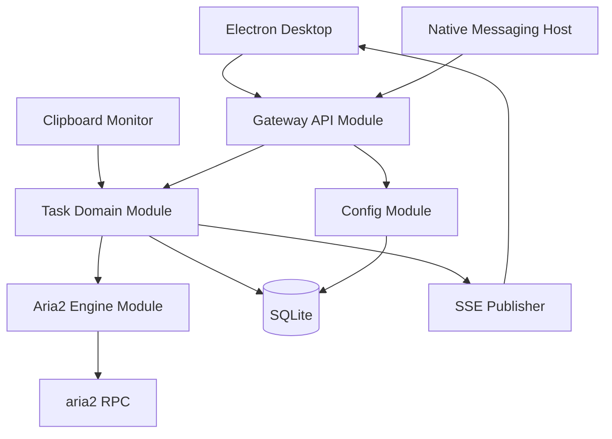
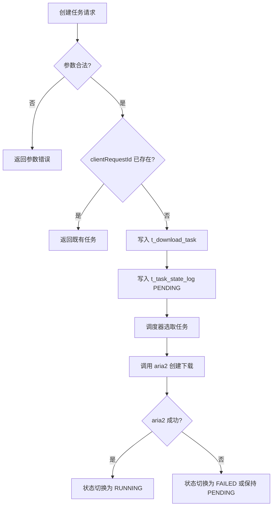
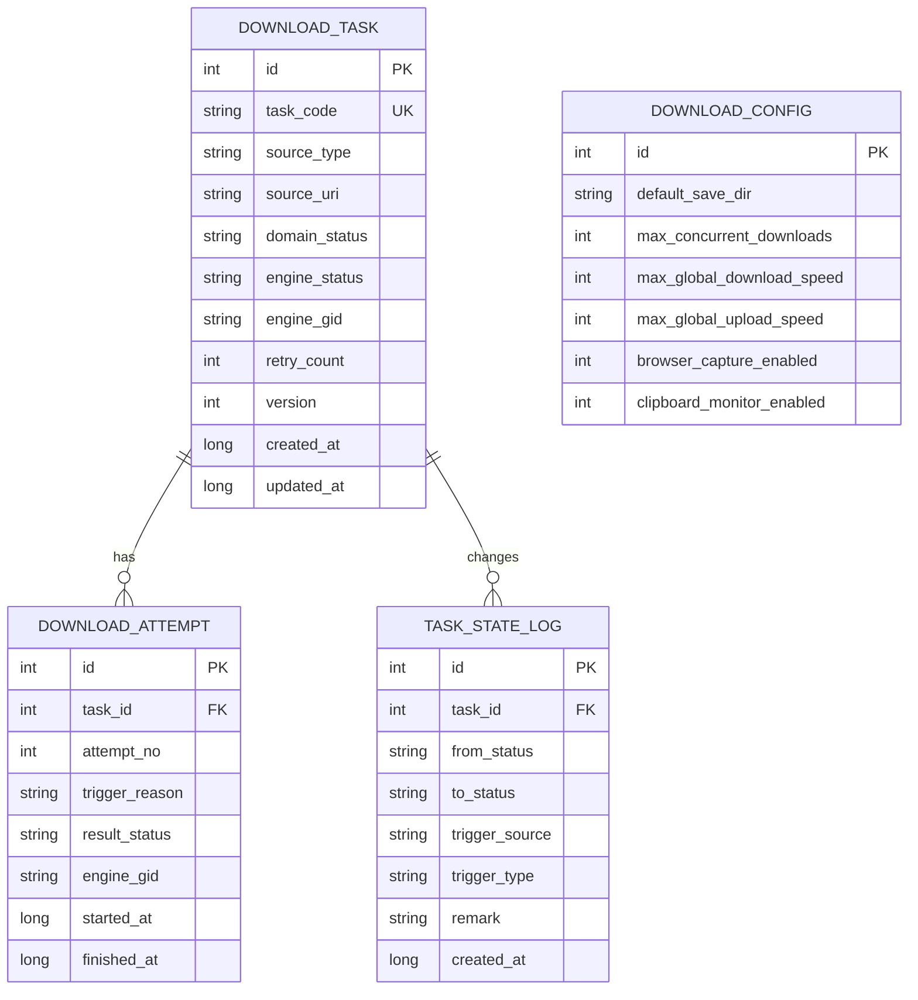
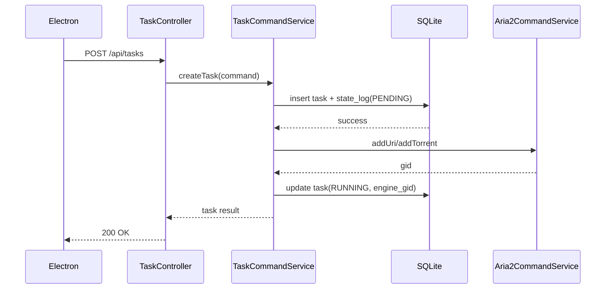
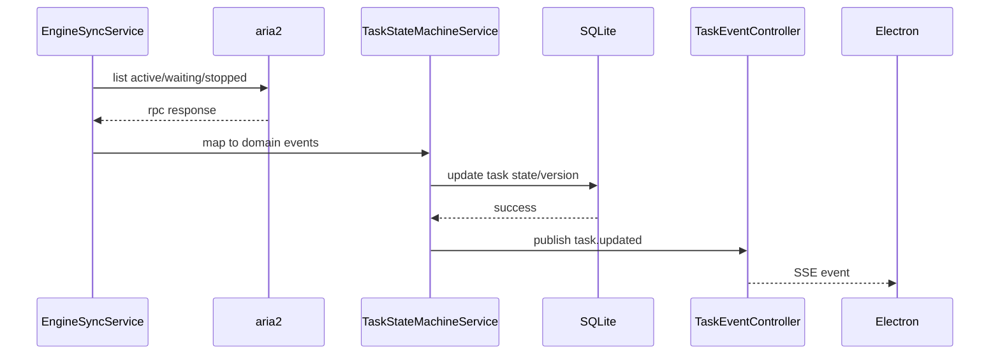

# MoodDownload 后端详细设计

## 1. 文档信息

| 项目 | 内容 |
| --- | --- |
| 文档名称 | `MoodDownload 后端详细设计` |
| 版本 | `v0.1-draft` |
| 生成依据 | 已确认架构文档 + 后端设计确认结果 |
| 对应输入材料 | [architecture.md](/Users/lying/IdeaProjects/moodDownload/docs/architecture.md) |
| 适用范围 | `local-service` 后端工程、SQLite、本地 API、aria2 适配、任务状态机、浏览器接入网关 |
| 不在本文覆盖范围 | Electron 页面细节、浏览器扩展内部实现、NSIS 安装包细节 |

## 2. 项目背景与项目价值

### 2.1 项目背景

- 业务背景：构建一个面向 `Windows 10/11` 的本地下载工具，首版能力接近 `Motrix` 核心体验。
- 当前痛点：需要统一承接 `HTTP/HTTPS`、`BT`、`磁力链接`、浏览器接管、剪贴板监听，并在本地完成稳定调度。
- 触发建设原因：单人、两周交付周期下，需要在成熟下载内核之上建立可维护的本地业务中枢。

### 2.2 项目价值

- 对业务价值：形成后续可迭代的本地下载平台基础，而不是一次性脚手架。
- 对用户价值：统一下载入口、实时状态可见、任务操作一致。
- 对交付效率价值：复用 aria2 执行层，后端聚焦状态机、调度、配置和接入编排。
- 对系统治理价值：通过明确分层、状态机、日志与本地安全边界，降低后续维护成本。

## 3. 输入依据与设计边界

| 输入材料 | 类型 | 来源 | 当前状态 | 备注 |
| --- | --- | --- | --- | --- |
| 架构文档 | 文档 | 用户指定路径 | 已确认 | 作为主输入基线 |
| PRD | 文档 | 未提供 | 待补充 | 本文不依赖 |
| 现有系统代码 | 代码 | 用户确认无 | 已确认 | 新项目 |
| 技术约束 | 约束 | 用户确认 | 已确认 | `JDK 8`、`Maven`、`log4j` |

- 本文覆盖的模块：
  - 任务领域模型与状态机
  - 本地 REST/SSE API
  - aria2 适配层
  - 扩展接入网关
  - 剪贴板监听
  - 配置中心
  - SQLite 持久化
  - 异常、幂等、并发、安全、日志
- 本文不覆盖的模块：
  - Electron 页面组件设计
  - 浏览器扩展脚本实现
  - 安装器与发布流程
- 已确认假设：
  - 后端保持单项目、模块化单体、统一部署单元
  - 不拆多服务，不引入 Redis/MQ/搜索服务
  - aria2 为实际下载执行器
  - 采用“领域状态机驱动型”方案
- 待确认假设：
  - `Mapper` 技术实现推荐 `MyBatis`，当前记为 `TBD`
  - aria2 是否随安装包一起内置分发，当前记为 `TBD`

## 4. 总体后端架构

### 4.1 复杂度与拆分决策

| 评估维度 | 当前判断 | 结论影响 |
| --- | --- | --- |
| 业务复杂度 | 中 | 需要清晰模块边界，但不需要独立服务 |
| 团队规模与协作方式 | 单人开发 | 不适合微服务与多仓协作 |
| 部署与扩缩容要求 | 本地统一部署 | 不需要独立扩缩容 |
| 一致性与事务复杂度 | 本地强一致优先，外部引擎最终一致补偿 | 适合单项目状态机编排 |
| 运维治理能力 | 低 | 不应引入多服务治理成本 |

- 架构类型：`模块化单体`
- 是否沿用上游结论：`是`
- 结论理由：
  - 上游已明确“桌面端 + 本地服务 + 下载内核 + 浏览器扩展”的模块化本地架构。
  - 当前只有一个本地服务进程，无独立扩容、灰度、跨团队协作诉求。
  - 两周 MVP 周期下，多服务只会增加进程通信、调试和安装复杂度。
- 当前阶段不采用的方案及原因：
  - 微服务：本地场景无收益，治理成本高。
  - 纯 aria2 编排型：交付快，但业务语义过度绑定 aria2。
  - 轻量单包结构：不足以承载领域状态机、aria2 适配、接入网关和配置中心的长期维护。

### 4.2 后端职责边界

- 对桌面端提供本地 `REST` 与 `SSE`
- 对扩展 Native Host 提供本地受控接入接口
- 对 aria2 提供适配、调度与状态映射
- 对 SQLite 提供事务化持久化
- 内部维护统一任务领域模型与状态机

### 4.3 架构图



### 4.4 技术基线

- 推断：由于 `Spring Boot 2.7.18` 官方文档说明其需要 `Java 8`，本文后端基线按 `Spring Boot 2.7.x` 兼容线设计，精确补丁版本可在落地时确定。
- 日志实现按 `Log4j2` 落地，配置文件使用 `log4j2-spring.xml`。
- SQLite 为本地单文件数据库，不单独部署数据库服务。

## 5. 核心业务流程

### 5.1 下载任务创建流程

- 触发条件：桌面端手动新增、浏览器扩展接管、剪贴板识别确认。
- 主流程：
  - 参数校验
  - 生成 `clientRequestId` 或读取调用方幂等键
  - 创建任务聚合根 `DownloadTask`
  - 初始化状态为 `PENDING`
  - 写入任务表、状态日志表
  - 调度器异步尝试分发
- 异常流程：
  - 非法链接或种子解析失败直接返回校验错误
  - 同一幂等键重复请求返回已存在任务
- 幂等：
  - `clientRequestId` 全局唯一，重复创建只返回既有任务
- 补偿：
  - 任务已落库但未成功分发时，保持 `PENDING` 由调度器重试



### 5.2 调度与重试流程

- 触发条件：新任务入队、任务恢复、失败重试、暂停后恢复。
- 主流程：
  - 调度器按 `queue_priority + created_at` 选取 `PENDING` 任务
  - 通过乐观锁抢占任务
  - 进入 `DISPATCHING`
  - 调用 aria2 RPC 建立下载
  - 成功则写入 `engine_gid` 并转 `RUNNING`
- 分支流程：
  - aria2 暂时不可用：可回退 `PENDING`
  - 业务失败次数超阈值：转 `FAILED`
- 幂等：
  - 同一任务同一版本只能被一个调度线程抢占
- 补偿：
  - 本地状态成功变更但 RPC 超时，由同步器按 `engine_gid` 和来源 URI 反查对账

### 5.3 引擎同步与恢复流程

- 触发条件：定时轮询、应用重启、显式刷新
- 主流程：
  - 轮询 aria2 当前活跃 / 等待 / 停止任务
  - 适配层将 aria2 状态映射为领域事件
  - 状态机按规则流转本地任务
  - SSE 推送前端变更
- 异常流程：
  - 本地有任务但引擎无记录：进入 `RECONCILING`
  - 引擎有记录但本地无任务：忽略并记录告警日志
- 一致性策略：
  - 数据库状态为业务真相
  - aria2 状态为执行真相
  - 通过“状态机 + 对账轮询”达成最终一致

### 5.4 状态机定义

| 领域状态 | 含义 | 可迁入 | 可迁出 |
| --- | --- | --- | --- |
| `PENDING` | 已建任务，待调度 | 创建、恢复、重试 | `DISPATCHING`、`CANCELLED` |
| `DISPATCHING` | 正在提交给 aria2 | `PENDING` | `RUNNING`、`FAILED`、`PENDING` |
| `RUNNING` | 正在下载 | `DISPATCHING`、`RESUME` | `PAUSED`、`COMPLETED`、`FAILED`、`CANCELLED` |
| `PAUSED` | 已暂停 | `RUNNING` | `PENDING`、`CANCELLED` |
| `FAILED` | 失败待人工/自动重试 | `DISPATCHING`、`RUNNING` | `PENDING`、`CANCELLED` |
| `COMPLETED` | 下载完成 | `RUNNING` | 无 |
| `CANCELLED` | 已删除/取消 | `PENDING`、`PAUSED`、`FAILED`、`RUNNING` | 无 |
| `RECONCILING` | 启动恢复或对账中 | 任意异常态 | `PENDING`、`RUNNING`、`FAILED` |

## 6. 工程拆分与 Package 设计

### 6.1 工程拆分结论

- 工程形态：`单个 Spring Boot Maven 项目 + 包级模块化单体`
- 是否拆分多个子项目：`否，统一为一个 local-service 后端项目`
- 拆分依据：统一部署、统一本地进程、统一 SQLite，本阶段不引入 Maven 聚合多模块
- 共享基础包范围：公共异常、通用响应、时间/ID/安全工具、常量枚举

### 6.2 顶层工程树

```text
mood-download-local-service
├── pom.xml
├── docs
└── src
    ├── main
    │   ├── java/com/mooddownload/local
    │   │   ├── bootstrap
    │   │   ├── common
    │   │   ├── controller
    │   │   ├── service
    │   │   ├── dal
    │   │   ├── mapper
    │   │   ├── client
    │   │   └── util
    │   └── resources
    └── test
```

| 逻辑模块 | 是否独立部署 | 是否独立数据库 | 说明 |
| --- | --- | --- | --- |
| `task` | 否 | 否 | 下载任务领域、状态机、调度、重试 |
| `engine` | 否 | 否 | aria2 RPC 适配、状态映射、同步器 |
| `config` | 否 | 否 | 用户配置、运行参数 |
| `capture` | 否 | 否 | 扩展接入、剪贴板监听、本地安全校验 |
| `common` | 否 | 否 | 公共对象、异常、工具、基础配置 |

### 6.3 分层约束

| 层级 / package | 核心职责 | 主要对象 | 强制规则 |
| --- | --- | --- | --- |
| `controller` | 对接桌面端 / Native Host | `*Request`、`*Response`、`*VO` | 类名后缀必须为 `Controller` |
| `controller.vo` | 控制层入参/出参 | `*Request`、`*Response` | 不得下沉到 `dal` / `mapper` |
| `controller.convert` | `VO <-> Model` 转换 | `VO`、`*Model` | 不承载业务逻辑 |
| `service` | 业务编排、事务、状态机 | Service、DomainService | 必须按业务场景拆子包 |
| `service.model` | 服务层模型 | `*Model` | 不直接暴露 `DO` |
| `service.convert` | `DO <-> Model` 转换 | `DO`、`*Model` | `DO` 不得直接返回给 `controller` |
| `dal` | 数据访问封装 | `*Repository` | 访问类后缀统一为 `Repository`，仅承载数据库访问聚合 |
| `mapper` | SQL 查询与映射 | `Mapper`、`*DO` | 持久化对象后缀统一为 `DO` |
| `client` | 外部引擎 / 外部进程访问 | `*Client`、RPC DTO | 不与 `mapper` 混用，不直接暴露给 `controller` |
| `util` | 通用工具 | `*Util` | 不承载核心业务编排 |

### 6.4 推荐包结构

```text
com.mooddownload.local
├── bootstrap
├── common
│   ├── constant
│   ├── enums
│   ├── exception
│   ├── response
│   ├── security
├── util
├── controller
│   ├── task
│   │   ├── TaskController.java
│   │   ├── TaskEventController.java
│   │   ├── vo
│   │   └── convert
│   ├── config
│   │   ├── ConfigController.java
│   │   ├── vo
│   │   └── convert
│   └── capture
│       ├── ExtensionCaptureController.java
│       ├── vo
│       └── convert
├── service
│   ├── task
│   │   ├── TaskCommandService.java
│   │   ├── TaskQueryService.java
│   │   ├── TaskStateMachineService.java
│   │   ├── TaskDispatchScheduler.java
│   │   ├── TaskRetryScheduler.java
│   │   ├── model
│   │   ├── convert
│   │   ├── event
│   │   └── state
│   ├── engine
│   │   ├── Aria2CommandService.java
│   │   ├── Aria2SyncService.java
│   │   ├── model
│   │   └── convert
│   ├── config
│   │   ├── ConfigService.java
│   │   ├── model
│   │   └── convert
│   └── capture
│       ├── ExtensionCaptureService.java
│       ├── ClipboardCaptureService.java
│       ├── model
│       └── convert
├── dal
│   ├── task
│   │   ├── DownloadTaskRepository.java
│   │   ├── DownloadAttemptRepository.java
│   │   └── TaskStateLogRepository.java
│   └── config
│       └── DownloadConfigRepository.java
├── mapper
│   ├── task
│   │   ├── DownloadTaskMapper.java
│   │   ├── DownloadAttemptMapper.java
│   │   ├── TaskStateLogMapper.java
│   │   ├── DownloadTaskDO.java
│   │   ├── DownloadAttemptDO.java
│   │   └── TaskStateLogDO.java
│   └── config
│       ├── DownloadConfigMapper.java
│       └── DownloadConfigDO.java
└── client
    └── aria2
        ├── Aria2RpcClient.java
        ├── dto
        └── convert
```

### 6.5 对象流转链路

```text
前端请求 -> controller.{scene} -> controller.{scene}.convert -> service.{scene}.model
-> service.{scene} -> dal.{scene} -> mapper.{scene} -> DO
DO -> service.{scene}.convert -> Model -> controller.{scene}.convert -> Response VO -> 前端响应
```

- aria2 外部调用链路：`service.engine -> client.aria2 -> aria2 RPC`
- 逻辑场景之间默认通过 `service` 或显式 facade 调用
- 禁止跨场景直接依赖对方 `Mapper`、`Repository`、`DO`

## 7. 模块设计

| 模块 | 职责 | 输入 | 输出 | 依赖 | 关键规则 |
| --- | --- | --- | --- | --- | --- |
| `task` | 任务聚合、状态机、调度、重试 | 控制层命令、引擎事件 | 任务状态、调度决策、SSE 事件 | `service.engine`、`service.config`、`common` | 领域状态只在此场景变更 |
| `engine` | aria2 RPC 调用、状态映射、同步 | 任务调度命令、轮询触发 | aria2 结果、引擎事件 | `client.aria2`、`common` | 不直接改数据库状态 |
| `config` | 运行配置读取/更新 | 设置页命令 | 生效配置模型 | `common` | 配置变更需持久化并发通知 |
| `capture` | 扩展接入、剪贴板监听 | Native Host 请求、本地剪贴板 | 统一创建任务命令 | `service.task`、`common` | 只做接入转换，不做任务流转 |
| `common` | 公共异常、响应、日志、安全工具 | N/A | N/A | N/A | 不承载业务语义 |

## 8. 数据模型设计

### 8.1 实体关系

| 实体 | 说明 | 关键字段 | 与其他实体关系 |
| --- | --- | --- | --- |
| `download_task` | 下载任务聚合根 | `id`、`task_code`、`domain_status`、`engine_gid` | 1:N `download_attempt`、1:N `task_state_log` |
| `download_attempt` | 一次调度/重试尝试 | `task_id`、`attempt_no`、`result_status` | N:1 `download_task` |
| `download_config` | 本地配置 | `id`、`default_save_dir` | 独立实体 |
| `task_state_log` | 状态变更日志 | `task_id`、`from_status`、`to_status` | N:1 `download_task` |

### 8.2 ER 图



## 9. 表设计与 SQL

### 9.1 `t_download_task`

| 字段 | 类型 | 约束 | 默认值 | 说明 |
| --- | --- | --- | --- | --- |
| `id` | INTEGER | PK | 自增 | 主键 |
| `task_code` | TEXT | UNIQUE NOT NULL |  | 业务任务编码 |
| `source_type` | TEXT | NOT NULL |  | `HTTP/HTTPS/BT/MAGNET/TORRENT` |
| `source_uri` | TEXT | NOT NULL |  | 来源链接或磁力 |
| `display_name` | TEXT |  |  | 展示名称 |
| `domain_status` | TEXT | NOT NULL | `PENDING` | 领域状态 |
| `engine_status` | TEXT | NOT NULL | `UNKNOWN` | aria2 状态快照 |
| `engine_gid` | TEXT | UNIQUE |  | aria2 任务标识 |
| `save_dir` | TEXT | NOT NULL |  | 保存目录 |
| `retry_count` | INTEGER | NOT NULL | `0` | 已重试次数 |
| `max_retry_count` | INTEGER | NOT NULL | `3` | 最大重试次数 |
| `client_request_id` | TEXT | UNIQUE |  | 幂等键 |
| `version` | INTEGER | NOT NULL | `0` | 乐观锁版本 |
| `created_at` | INTEGER | NOT NULL |  | Epoch millis |
| `updated_at` | INTEGER | NOT NULL |  | Epoch millis |

```sql
CREATE TABLE t_download_task (
    id INTEGER PRIMARY KEY AUTOINCREMENT,
    task_code TEXT NOT NULL UNIQUE,
    source_type TEXT NOT NULL,
    source_uri TEXT NOT NULL,
    source_hash TEXT,
    torrent_file_path TEXT,
    display_name TEXT,
    domain_status TEXT NOT NULL DEFAULT 'PENDING',
    engine_status TEXT NOT NULL DEFAULT 'UNKNOWN',
    engine_gid TEXT UNIQUE,
    queue_priority INTEGER NOT NULL DEFAULT 100,
    save_dir TEXT NOT NULL,
    total_size_bytes INTEGER NOT NULL DEFAULT 0,
    completed_size_bytes INTEGER NOT NULL DEFAULT 0,
    download_speed_bps INTEGER NOT NULL DEFAULT 0,
    upload_speed_bps INTEGER NOT NULL DEFAULT 0,
    error_code TEXT,
    error_message TEXT,
    retry_count INTEGER NOT NULL DEFAULT 0,
    max_retry_count INTEGER NOT NULL DEFAULT 3,
    client_request_id TEXT UNIQUE,
    last_sync_at INTEGER,
    version INTEGER NOT NULL DEFAULT 0,
    created_at INTEGER NOT NULL,
    updated_at INTEGER NOT NULL
);
CREATE INDEX idx_task_status_priority ON t_download_task(domain_status, queue_priority, created_at);
CREATE INDEX idx_task_source_hash ON t_download_task(source_hash);
CREATE INDEX idx_task_updated_at ON t_download_task(updated_at);
```

### 9.2 `t_download_attempt`

| 字段 | 类型 | 约束 | 默认值 | 说明 |
| --- | --- | --- | --- | --- |
| `id` | INTEGER | PK | 自增 | 主键 |
| `task_id` | INTEGER | FK NOT NULL |  | 任务 ID |
| `attempt_no` | INTEGER | NOT NULL |  | 第几次尝试 |
| `trigger_reason` | TEXT | NOT NULL |  | `CREATE/RETRY/RECOVER` |
| `result_status` | TEXT | NOT NULL |  | `SUCCESS/FAILED/CANCELLED` |
| `engine_gid` | TEXT |  |  | 该次尝试对应引擎 gid |

```sql
CREATE TABLE t_download_attempt (
    id INTEGER PRIMARY KEY AUTOINCREMENT,
    task_id INTEGER NOT NULL,
    attempt_no INTEGER NOT NULL,
    trigger_reason TEXT NOT NULL,
    result_status TEXT NOT NULL,
    engine_gid TEXT,
    fail_phase TEXT,
    fail_message TEXT,
    started_at INTEGER NOT NULL,
    finished_at INTEGER,
    created_at INTEGER NOT NULL,
    updated_at INTEGER NOT NULL,
    CONSTRAINT fk_attempt_task FOREIGN KEY (task_id) REFERENCES t_download_task(id)
);
CREATE UNIQUE INDEX uk_attempt_task_no ON t_download_attempt(task_id, attempt_no);
CREATE INDEX idx_attempt_task_created ON t_download_attempt(task_id, created_at);
```

### 9.3 `t_download_config`

| 字段 | 类型 | 约束 | 默认值 | 说明 |
| --- | --- | --- | --- | --- |
| `id` | INTEGER | PK CHECK(`id=1`) | `1` | 单例配置 |
| `default_save_dir` | TEXT | NOT NULL |  | 默认目录 |
| `max_concurrent_downloads` | INTEGER | NOT NULL | `3` | 最大并发 |
| `max_global_download_speed` | INTEGER | NOT NULL | `0` | `0` 表示不限速 |
| `max_global_upload_speed` | INTEGER | NOT NULL | `0` | `0` 表示不限速 |

```sql
CREATE TABLE t_download_config (
    id INTEGER PRIMARY KEY CHECK (id = 1),
    default_save_dir TEXT NOT NULL,
    max_concurrent_downloads INTEGER NOT NULL DEFAULT 3,
    max_global_download_speed INTEGER NOT NULL DEFAULT 0,
    max_global_upload_speed INTEGER NOT NULL DEFAULT 0,
    browser_capture_enabled INTEGER NOT NULL DEFAULT 1,
    clipboard_monitor_enabled INTEGER NOT NULL DEFAULT 1,
    auto_start_enabled INTEGER NOT NULL DEFAULT 0,
    local_api_token TEXT,
    created_at INTEGER NOT NULL,
    updated_at INTEGER NOT NULL
);
```

### 9.4 `t_task_state_log`

```sql
CREATE TABLE t_task_state_log (
    id INTEGER PRIMARY KEY AUTOINCREMENT,
    task_id INTEGER NOT NULL,
    from_status TEXT,
    to_status TEXT NOT NULL,
    trigger_source TEXT NOT NULL,
    trigger_type TEXT NOT NULL,
    remark TEXT,
    created_at INTEGER NOT NULL,
    CONSTRAINT fk_state_log_task FOREIGN KEY (task_id) REFERENCES t_download_task(id)
);
CREATE INDEX idx_state_log_task_created ON t_task_state_log(task_id, created_at);
```

- 分库分表：`不采用`
- 软删除：`不采用`，删除任务走物理删除 + 状态日志保留策略 `TBD`
- 乐观锁：`采用`，用于任务状态抢占和恢复对账
- SQLite 约束：启动时开启 `PRAGMA foreign_keys = ON`

## 10. API 设计

### 10.1 接口总览

| 接口名称 | 路径 | 方法 | 鉴权 | 说明 |
| --- | --- | --- | --- | --- |
| 创建下载任务 | `/api/tasks` | `POST` | `X-Local-Token` | URL / 磁力创建 |
| 导入种子任务 | `/api/tasks/torrent` | `POST` | `X-Local-Token` | `.torrent` 上传 |
| 任务列表 | `/api/tasks` | `GET` | `X-Local-Token` | 查询任务 |
| 任务详情 | `/api/tasks/{id}` | `GET` | `X-Local-Token` | 查询详情 |
| 暂停任务 | `/api/tasks/{id}/pause` | `POST` | `X-Local-Token` | 暂停 |
| 继续任务 | `/api/tasks/{id}/resume` | `POST` | `X-Local-Token` | 继续 |
| 重试任务 | `/api/tasks/{id}/retry` | `POST` | `X-Local-Token` | 失败重试 |
| 删除任务 | `/api/tasks/{id}` | `DELETE` | `X-Local-Token` | 删除 |
| 查询配置 | `/api/config` | `GET` | `X-Local-Token` | 读取配置 |
| 更新配置 | `/api/config` | `PUT` | `X-Local-Token` | 更新配置 |
| 扩展接管入口 | `/api/extension/capture` | `POST` | `X-Local-Token` + `X-Client-Type=native-host` | 浏览器接管 |
| SSE 事件流 | `/api/events/tasks` | `GET` | `X-Local-Token` | 任务状态推送 |

### 10.2 公共响应结构

```json
{
  "code": 0,
  "message": "ok",
  "requestId": "req-20260418-001",
  "data": {}
}
```

除 `SSE` 外，以下接口“出参字段”均指 `data` 对象内部字段。

### 10.3 核心接口明细

#### 10.3.1 创建下载任务

- 路径：`/api/tasks`
- 方法：`POST`
- 鉴权要求：`X-Local-Token`
- 幂等要求：`clientRequestId` 必填
- 触发时机：桌面端新增 URL / 磁力
- 调用方：Electron

| 字段 | 位置 | 类型 | 必填 | 说明 |
| --- | --- | --- | --- | --- |
| `clientRequestId` | body | string | 是 | 幂等键 |
| `sourceType` | body | string | 是 | `HTTP` / `HTTPS` / `MAGNET` |
| `sourceUri` | body | string | 是 | 下载来源 |
| `saveDir` | body | string | 否 | 为空则取默认目录 |
| `displayName` | body | string | 否 | 自定义任务名 |

| 出参字段 | 类型 | 说明 |
| --- | --- | --- |
| `taskId` | number | 任务 ID |
| `taskCode` | string | 任务编码 |
| `domainStatus` | string | 初始状态 |
| `engineStatus` | string | 引擎状态快照，初始通常为 `WAITING/UNKNOWN` |
| `createdAt` | number | 创建时间 |

响应示例：

```json
{
  "code": 0,
  "message": "ok",
  "requestId": "req-20260418-001",
  "data": {
    "taskId": 1024,
    "taskCode": "TASK-20260418-0001",
    "domainStatus": "PENDING",
    "engineStatus": "UNKNOWN",
    "createdAt": 1776460000000
  }
}
```

错误码：

| 错误码 | HTTP | 含义 | 触发条件 |
| --- | --- | --- | --- |
| `TASK_PARAM_INVALID` | 400 | 参数非法 | 链接为空或类型不支持 |
| `TASK_DUPLICATE_REQUEST` | 200 | 幂等重复 | `clientRequestId` 已存在 |
| `TASK_CREATE_FAILED` | 500 | 创建失败 | 落库异常 |

#### 10.3.2 导入种子任务

- 路径：`/api/tasks/torrent`
- 方法：`POST`
- 鉴权要求：`X-Local-Token`
- 幂等要求：`clientRequestId`
- 调用方：Electron
- 请求类型：`multipart/form-data`

| 字段 | 位置 | 类型 | 必填 | 说明 |
| --- | --- | --- | --- | --- |
| `clientRequestId` | form | string | 是 | 幂等键 |
| `torrentFile` | form | file | 是 | 种子文件 |
| `saveDir` | form | string | 否 | 保存目录 |

| 出参字段 | 类型 | 说明 |
| --- | --- | --- |
| `taskId` | number | 任务 ID |
| `taskCode` | string | 任务编码 |
| `domainStatus` | string | 初始状态 |
| `displayName` | string | 解析出的任务名 |

错误码：

| 错误码 | HTTP | 含义 | 触发条件 |
| --- | --- | --- | --- |
| `TORRENT_PARSE_FAILED` | 400 | 种子解析失败 | 文件非法 |
| `TASK_DUPLICATE_REQUEST` | 200 | 幂等重复 | 重复提交 |

#### 10.3.3 任务列表

- 路径：`/api/tasks`
- 方法：`GET`
- 鉴权要求：`X-Local-Token`
- 幂等要求：无
- 调用方：Electron

| 字段 | 位置 | 类型 | 必填 | 说明 |
| --- | --- | --- | --- | --- |
| `status` | query | string | 否 | 领域状态过滤 |
| `keyword` | query | string | 否 | 名称搜索 |
| `pageNo` | query | int | 否 | 默认 1 |
| `pageSize` | query | int | 否 | 默认 50 |

| 出参字段 | 类型 | 说明 |
| --- | --- | --- |
| `pageNo` | number | 当前页码 |
| `pageSize` | number | 每页条数 |
| `total` | number | 总记录数 |
| `items` | array | 任务列表 |

`items[]` 字段：

| 字段 | 类型 | 说明 |
| --- | --- | --- |
| `taskId` | number | 任务 ID |
| `taskCode` | string | 任务编码 |
| `displayName` | string | 展示名 |
| `sourceType` | string | 来源类型 |
| `domainStatus` | string | 领域状态 |
| `engineStatus` | string | 引擎状态 |
| `progress` | number | 进度，`0-1` |
| `downloadSpeedBps` | number | 当前下载速度 |
| `saveDir` | string | 保存目录 |
| `updatedAt` | number | 最近更新时间 |

响应示例：

```json
{
  "code": 0,
  "message": "ok",
  "requestId": "req-20260418-002",
  "data": {
    "pageNo": 1,
    "pageSize": 50,
    "total": 1,
    "items": [
      {
        "taskId": 1024,
        "taskCode": "TASK-20260418-0001",
        "displayName": "ubuntu.iso",
        "sourceType": "HTTP",
        "domainStatus": "RUNNING",
        "engineStatus": "active",
        "progress": 0.58,
        "downloadSpeedBps": 1048576,
        "saveDir": "D:/Downloads",
        "updatedAt": 1776460000000
      }
    ]
  }
}
```

#### 10.3.4 任务详情

- 路径：`/api/tasks/{id}`
- 方法：`GET`
- 鉴权要求：`X-Local-Token`
- 幂等要求：无
- 调用方：Electron

| 字段 | 位置 | 类型 | 必填 | 说明 |
| --- | --- | --- | --- | --- |
| `id` | path | number | 是 | 任务 ID |

| 出参字段 | 类型 | 说明 |
| --- | --- | --- |
| `taskId` | number | 任务 ID |
| `taskCode` | string | 任务编码 |
| `displayName` | string | 展示名 |
| `sourceType` | string | 来源类型 |
| `sourceUri` | string | 来源地址 |
| `domainStatus` | string | 领域状态 |
| `engineStatus` | string | 引擎状态 |
| `progress` | number | 进度，`0-1` |
| `totalSizeBytes` | number | 总大小 |
| `completedSizeBytes` | number | 已完成大小 |
| `downloadSpeedBps` | number | 当前下载速度 |
| `uploadSpeedBps` | number | 当前上传速度 |
| `saveDir` | string | 保存目录 |
| `retryCount` | number | 当前重试次数 |
| `errorCode` | string | 最近错误码 |
| `errorMessage` | string | 最近错误信息 |
| `createdAt` | number | 创建时间 |
| `updatedAt` | number | 更新时间 |

#### 10.3.5 暂停任务

- 路径：`/api/tasks/{id}/pause`
- 方法：`POST`
- 鉴权要求：`X-Local-Token`
- 幂等要求：幂等，重复暂停返回成功
- 调用方：Electron

| 字段 | 位置 | 类型 | 必填 | 说明 |
| --- | --- | --- | --- | --- |
| `id` | path | number | 是 | 任务 ID |

| 出参字段 | 类型 | 说明 |
| --- | --- | --- |
| `taskId` | number | 任务 ID |
| `domainStatus` | string | 暂停后的领域状态 |
| `operationApplied` | boolean | 本次操作是否真正生效 |

错误码：

| 错误码 | HTTP | 含义 | 触发条件 |
| --- | --- | --- | --- |
| `TASK_NOT_FOUND` | 404 | 任务不存在 | ID 无效 |
| `TASK_STATE_INVALID` | 409 | 状态不允许暂停 | 非 `RUNNING/PENDING` |

#### 10.3.6 继续任务

- 路径：`/api/tasks/{id}/resume`
- 方法：`POST`
- 鉴权要求：`X-Local-Token`
- 幂等要求：幂等，已运行则直接成功
- 调用方：Electron

| 字段 | 位置 | 类型 | 必填 | 说明 |
| --- | --- | --- | --- | --- |
| `id` | path | number | 是 | 任务 ID |

| 出参字段 | 类型 | 说明 |
| --- | --- | --- |
| `taskId` | number | 任务 ID |
| `domainStatus` | string | 恢复后的领域状态，通常为 `PENDING` |
| `operationApplied` | boolean | 本次操作是否真正生效 |

错误码：

| 错误码 | HTTP | 含义 | 触发条件 |
| --- | --- | --- | --- |
| `TASK_NOT_FOUND` | 404 | 任务不存在 | ID 无效 |
| `TASK_STATE_INVALID` | 409 | 状态不允许恢复 | 非 `PAUSED/FAILED` |

#### 10.3.7 重试任务

- 路径：`/api/tasks/{id}/retry`
- 方法：`POST`
- 鉴权要求：`X-Local-Token`
- 幂等要求：同一失败版本只允许一次有效重试
- 调用方：Electron

| 字段 | 位置 | 类型 | 必填 | 说明 |
| --- | --- | --- | --- | --- |
| `id` | path | number | 是 | 任务 ID |

| 出参字段 | 类型 | 说明 |
| --- | --- | --- |
| `taskId` | number | 任务 ID |
| `domainStatus` | string | 重试后的领域状态 |
| `retryCount` | number | 更新后的重试次数 |
| `operationApplied` | boolean | 是否已进入重试流程 |

错误码：

| 错误码 | HTTP | 含义 | 触发条件 |
| --- | --- | --- | --- |
| `TASK_RETRY_NOT_ALLOWED` | 409 | 不允许重试 | 状态非 `FAILED` |
| `TASK_MAX_RETRY_EXCEEDED` | 409 | 超过最大重试次数 | 达到阈值 |

#### 10.3.8 删除任务

- 路径：`/api/tasks/{id}`
- 方法：`DELETE`
- 鉴权要求：`X-Local-Token`
- 幂等要求：幂等
- 调用方：Electron

| 字段 | 位置 | 类型 | 必填 | 说明 |
| --- | --- | --- | --- | --- |
| `id` | path | number | 是 | 任务 ID |
| `removeFiles` | query | boolean | 否 | 是否删除已下载文件 |

| 出参字段 | 类型 | 说明 |
| --- | --- | --- |
| `taskId` | number | 已删除任务 ID |
| `removed` | boolean | 是否已删除成功 |
| `filesRemoved` | boolean | 文件是否一并删除 |

#### 10.3.9 查询配置

- 路径：`/api/config`
- 方法：`GET`
- 鉴权要求：`X-Local-Token`
- 幂等要求：无
- 调用方：Electron

| 出参字段 | 类型 | 说明 |
| --- | --- | --- |
| `defaultSaveDir` | string | 默认下载目录 |
| `maxConcurrentDownloads` | number | 并发下载数 |
| `maxGlobalDownloadSpeed` | number | 全局下载限速 |
| `maxGlobalUploadSpeed` | number | 全局上传限速 |
| `browserCaptureEnabled` | boolean | 浏览器接管是否开启 |
| `clipboardMonitorEnabled` | boolean | 剪贴板监听是否开启 |
| `autoStartEnabled` | boolean | 开机启动是否开启 |
| `updatedAt` | number | 更新时间 |

#### 10.3.10 更新配置

- 路径：`/api/config`
- 方法：`PUT`
- 鉴权要求：`X-Local-Token`
- 幂等要求：同一配置值重复提交可覆盖成功
- 调用方：Electron

| 字段 | 位置 | 类型 | 必填 | 说明 |
| --- | --- | --- | --- | --- |
| `defaultSaveDir` | body | string | 否 | 默认目录 |
| `maxConcurrentDownloads` | body | int | 否 | 并发数 |
| `maxGlobalDownloadSpeed` | body | int | 否 | 下载限速 |
| `maxGlobalUploadSpeed` | body | int | 否 | 上传限速 |
| `browserCaptureEnabled` | body | boolean | 否 | 浏览器接管开关 |
| `clipboardMonitorEnabled` | body | boolean | 否 | 剪贴板监听开关 |

| 出参字段 | 类型 | 说明 |
| --- | --- | --- |
| `defaultSaveDir` | string | 更新后的默认目录 |
| `maxConcurrentDownloads` | number | 更新后的并发下载数 |
| `maxGlobalDownloadSpeed` | number | 更新后的全局下载限速 |
| `maxGlobalUploadSpeed` | number | 更新后的全局上传限速 |
| `browserCaptureEnabled` | boolean | 更新后的浏览器接管状态 |
| `clipboardMonitorEnabled` | boolean | 更新后的剪贴板监听状态 |
| `updatedAt` | number | 更新时间 |

#### 10.3.11 扩展接管入口

- 路径：`/api/extension/capture`
- 方法：`POST`
- 鉴权要求：`X-Local-Token` + `X-Client-Type=native-host`
- 幂等要求：`clientRequestId`
- 调用方：Native Host

| 字段 | 位置 | 类型 | 必填 | 说明 |
| --- | --- | --- | --- | --- |
| `clientRequestId` | body | string | 是 | 幂等键 |
| `browser` | body | string | 是 | `chrome/edge` |
| `tabUrl` | body | string | 否 | 来源页面 |
| `downloadUrl` | body | string | 是 | 真实下载地址 |
| `suggestedName` | body | string | 否 | 浏览器建议文件名 |

| 出参字段 | 类型 | 说明 |
| --- | --- | --- |
| `accepted` | boolean | 是否已接收入队 |
| `taskId` | number | 生成的任务 ID |
| `taskCode` | string | 任务编码 |
| `domainStatus` | string | 当前领域状态 |

#### 10.3.12 SSE 事件流

- 路径：`/api/events/tasks`
- 方法：`GET`
- 鉴权要求：`X-Local-Token`
- 幂等要求：无
- 调用方：Electron

事件字段：

| 字段 | 类型 | 说明 |
| --- | --- | --- |
| `eventType` | string | 事件类型，如 `task.updated` |
| `taskId` | number | 任务 ID |
| `taskCode` | string | 任务编码 |
| `domainStatus` | string | 领域状态 |
| `engineStatus` | string | 引擎状态 |
| `progress` | number | 进度，`0-1` |
| `downloadSpeedBps` | number | 当前下载速度 |
| `timestamp` | number | 事件时间 |

事件示例：

```json
{
  "eventType": "task.updated",
  "taskId": 1024,
  "taskCode": "TASK-20260418-0001",
  "domainStatus": "RUNNING",
  "engineStatus": "active",
  "progress": 0.58,
  "downloadSpeedBps": 1048576,
  "timestamp": 1776460000000
}
```

## 11. 时序与系统流程

### 11.1 创建并启动下载时序



### 11.2 引擎同步与前端推送



## 12. 异常处理、幂等、并发、一致性、安全、日志、监控

### 12.1 异常处理

- 参数错误：统一返回 `400` + 业务错误码
- 任务不存在：返回 `404`
- 状态流转非法：返回 `409`
- 外部引擎异常：返回 `502/500`，并写入 `FAILED` 或 `PENDING`
- 数据库异常：记录错误日志，必要时回滚事务

### 12.2 幂等

- 创建类接口必须传 `clientRequestId`
- 暂停/继续/删除接口按“目标状态已达成”处理为幂等成功
- Native Host 重放请求不重复创建任务

### 12.3 并发控制

- 调度抢占采用 `version` 乐观锁
- 同一任务的状态变更串行进入 `TaskStateMachineService`
- aria2 轮询同步与用户操作写库都必须校验状态与版本
- 配置更新使用单行配置表覆盖写，不需要分布式锁

### 12.4 一致性

- 本地数据库是业务状态真相
- aria2 是执行状态真相
- 两者不做分布式事务，依靠：
  - 事务内状态变更
  - 引擎轮询对账
  - 启动恢复重建
  - 状态日志追溯

### 12.5 安全

- 本地服务仅监听 `127.0.0.1`
- 所有 HTTP/SSE 请求必须携带 `X-Local-Token`
- Native Host 额外校验 `X-Client-Type=native-host`
- 不开放跨域给普通浏览器页面
- aria2 RPC 仅允许本地访问，RPC 密钥策略记为 `TBD`

### 12.6 日志

- `log4j2-spring.xml`
- 关键日志字段：`requestId`、`taskId`、`taskCode`、`engineGid`、`clientType`
- 日志级别：
  - `INFO`：状态变更、调度成功、配置变更
  - `WARN`：重试、对账异常、非法状态流转
  - `ERROR`：落库失败、aria2 调用失败、恢复失败

### 12.7 监控

- MVP 建议本地启用 `health` 与基础运行指标，是否开启 Actuator 端点记为 `TBD`
- 前端通过 SSE 监控任务状态，无需额外推送系统

## 13. 风险、假设、待确认项

- 风险：
  - Native Host 到本地服务的令牌与安装路径管理容易成为首版问题点
  - aria2 与领域状态机映射处理不当会出现“界面状态抖动”
  - JDK8 约束收窄了 Spring Boot 版本线
- 假设：
  - 后端部署为单机单实例
  - SQLite 文件不存在并发多进程写入场景
- 待确认：
  - 持久层是否固定为 `MyBatis`
  - aria2 是否内置打包
  - 本地 token 的生成/持久化路径
  - 删除任务时文件删除策略默认值

## 14. 参考来源

- Spring Boot 2.7.18 Getting Started: <https://docs.spring.io/spring-boot/docs/2.7.18/reference/html/getting-started.html>
- Spring Boot 2.7.18 Logging: <https://docs.spring.io/spring-boot/docs/2.7.18/reference/htmlsingle/>
- aria2 Manual: <https://aria2.github.io/manual/en/html/README.html>
- SQLite About: <https://www.sqlite.org/about.html>
- Chrome Native Messaging: <https://developer.chrome.com/docs/extensions/develop/concepts/native-messaging>
- Edge Native Messaging: <https://learn.microsoft.com/en-us/microsoft-edge/extensions/developer-guide/native-messaging>
