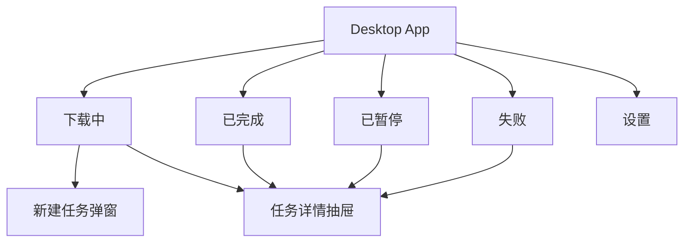
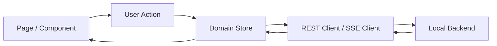
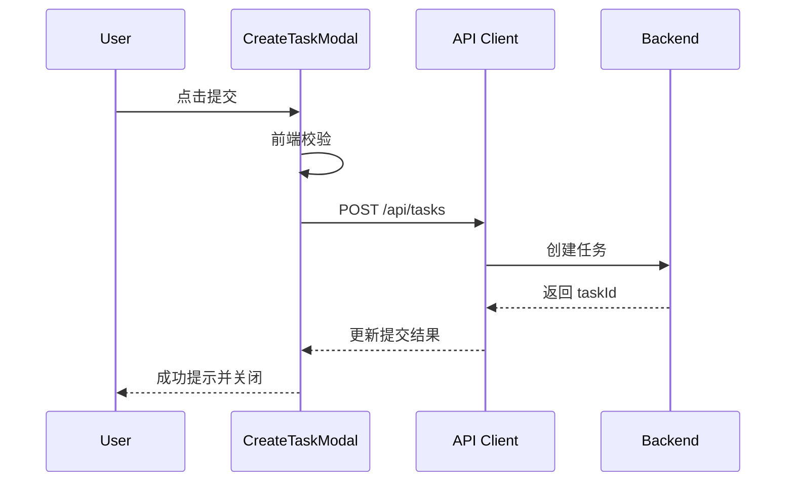
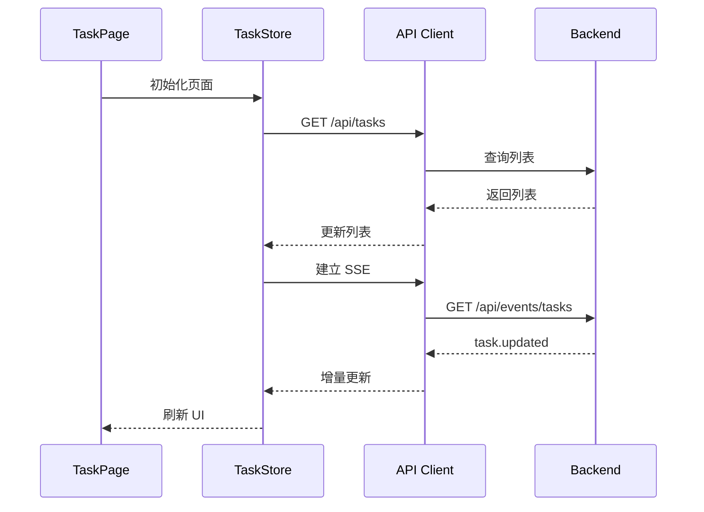

# MoodDownload 前端详细设计

## 1. 文档信息

| 项目 | 内容 |
| --- | --- |
| 文档名称 | `MoodDownload 前端详细设计` |
| 版本 | `v0.1-draft` |
| 生成依据 | 已确认架构文档 + 已确认后端详细设计 + 前端方案确认结果 |
| 对应输入材料 | [architecture.md](/Users/lying/IdeaProjects/moodDownload/docs/architecture.md) |
| 依赖的后端文档 | [backend-detailed-design.md](/Users/lying/IdeaProjects/moodDownload/docs/backend-detailed-design.md) |
| 适用范围 | `Electron` 桌面端前端、React SPA、与本地后端 `REST + SSE` 联动 |
| 不在本文覆盖范围 | 浏览器扩展内部实现、安装器与发布流程、云端页面 |

## 2. 项目背景与项目价值

### 2.1 项目背景

- 业务背景：构建一个面向 `Windows 10/11` 的本地下载软件，桌面端承担主要用户交互。
- 当前痛点：需要把任务列表、实时状态、设置管理、浏览器接管结果、剪贴板监听提示整合成一个统一的桌面体验。
- 本次前端设计触发原因：在已确认后端接口和状态模型的前提下，需要明确桌面端的信息架构、交互流程、状态管理与页面边界，支持两周内完成 MVP 交付。

### 2.2 项目价值

- 对用户体验价值：提供类似 `Motrix` 的统一下载视图、实时反馈和低学习成本操作路径。
- 对业务转化 / 运营效率价值：当前阶段无运营后台诉求，重点是提升本地下载体验一致性。
- 对交付效率价值：通过页面分域和契约驱动设计，减少前后端联调返工。
- 对可维护性价值：将任务域、配置域、接入域拆分，避免后续页面与状态逻辑混杂。

## 3. 输入依据与前端范围

| 输入材料 | 类型 | 来源 | 当前状态 | 备注 |
| --- | --- | --- | --- | --- |
| 架构文档 | 文档 | 用户指定路径 | 已确认 | 作为总体产品与技术基线 |
| 后端详细设计 | 文档 | 当前会话产出 | 已确认 | 作为接口、状态与约束依据 |
| 原型 / 交互稿 | 设计稿 | 未提供 | 待补充 | 当前按文档驱动设计 |
| UI 风格偏好 | 约束 | 用户确认 | 已确认 | 接近 `Motrix`，偏极客风 |

- 本文覆盖的端和页面：
  - `Electron` 桌面端
  - 下载中、已完成、已暂停、失败
  - 新建任务弹窗
  - 任务详情抽屉 / 侧栏
  - 设置页
- 不覆盖的端和页面：
  - 浏览器扩展页面
  - Web 管理端 / H5 / 运营后台
- 已确认假设：
  - 前端为 `SPA`
  - 采用 `左侧导航 + 主内容区`
  - 直连本地后端 `REST + SSE`
  - 支持托盘最小化
- 待确认假设：
  - 是否首版包含“关于 / 日志查看”页面，当前记为 `TBD`
  - 是否首版支持深色模式，当前记为 `TBD`

## 4. 用户角色与核心场景

### 4.1 用户角色

| 角色 | 目标 | 常见动作 | 权限边界 |
| --- | --- | --- | --- |
| 个人用户 | 统一管理本地下载任务 | 新建任务、查看状态、暂停继续、修改设置 | 无多角色权限，默认拥有全部前端功能 |

### 4.2 核心场景

- 场景 1：用户手动新增 URL / 磁力 / 种子任务并观察下载进度。
- 场景 2：浏览器扩展接管下载后，桌面端自动显示新任务并开始下载。
- 场景 3：用户在任务列表中执行暂停、继续、重试、删除等操作。
- 场景 4：用户修改下载目录、并发数、限速等设置并即时生效。
- 场景 5：系统检测到剪贴板中有可识别下载链接，提示用户快速创建任务。

## 5. 信息架构与路由结构

### 5.1 菜单结构

- 左侧导航：
  - 下载中
  - 已完成
  - 已暂停
  - 失败
  - 设置
- 全局动作：
  - 新建任务
  - 最小化到托盘
  - 窗口控制
- 上下文动作：
  - 查看详情
  - 暂停 / 继续 / 重试 / 删除

### 5.2 路由定义

| 页面 / 路由 | 访问角色 | 入口 | 主要功能 | 依赖接口 |
| --- | --- | --- | --- | --- |
| `/tasks/running` | 个人用户 | 左侧导航默认页 | 查看下载中 / 待调度任务 | `GET /api/tasks`、`GET /api/events/tasks` |
| `/tasks/completed` | 个人用户 | 左侧导航 | 查看已完成任务 | `GET /api/tasks` |
| `/tasks/paused` | 个人用户 | 左侧导航 | 查看已暂停任务 | `GET /api/tasks` |
| `/tasks/failed` | 个人用户 | 左侧导航 | 查看失败任务 | `GET /api/tasks` |
| `/settings` | 个人用户 | 左侧导航 | 修改目录、限速、并发等设置 | `GET /api/config`、`PUT /api/config` |
| `modal:create-task` | 个人用户 | 顶部新建按钮、剪贴板提示 | 创建 URL / 磁力 / 种子任务 | `POST /api/tasks`、`POST /api/tasks/torrent` |
| `drawer:task-detail` | 个人用户 | 点击任务项 | 查看任务详情与快捷操作 | `GET /api/tasks/{id}` |

### 5.3 页面层级图



## 6. 页面与模块拆分

### 6.1 页面域拆分原则

前端采用“页面容器分域型”：

- `task-domain`
  - 负责任务列表、任务详情、任务操作、SSE 事件消费
- `config-domain`
  - 负责设置页、配置读取与更新
- `capture-domain`
  - 负责浏览器接管结果提示、剪贴板识别提示、创建任务入口联动
- `shell-domain`
  - 负责桌面壳布局、导航、标题栏、托盘交互桥接、全局弹窗承载

### 6.2 页面 / 模块明细

| 页面 / 模块 | 组件组成 | 状态 | 事件 | 数据来源 | 备注 |
| --- | --- | --- | --- | --- | --- |
| 下载中页 | 左侧导航、统计条、任务列表、顶部操作栏 | loading/empty/error/realtime | 筛选、暂停、详情、新建 | `GET /api/tasks` + `SSE` | 默认首页 |
| 已完成页 | 左侧导航、任务列表、详情入口 | loading/empty/error | 查看详情、删除 | `GET /api/tasks` | 以浏览历史型展示为主 |
| 已暂停页 | 左侧导航、任务列表、批量操作区 | loading/empty/error | 继续、删除、详情 | `GET /api/tasks` | 支持恢复 |
| 失败页 | 左侧导航、任务列表、错误摘要 | loading/empty/error | 重试、删除、详情 | `GET /api/tasks` | 强调错误原因可见 |
| 新建任务弹窗 | 链接输入区、种子上传区、保存目录区、提交按钮 | idle/submitting/error | 提交、关闭 | `POST /api/tasks`、`POST /api/tasks/torrent` | 复用为剪贴板确认弹窗 |
| 任务详情抽屉 | 基本信息卡、进度信息、错误信息、操作按钮 | loading/error | 暂停、继续、重试、删除 | `GET /api/tasks/{id}` | 从列表上下文打开 |
| 设置页 | 目录设置、并发设置、限速设置、开关设置 | loading/saving/error/success | 保存、恢复默认值 `TBD` | `GET /api/config`、`PUT /api/config` | 即时或显式保存待定，默认显式保存 |
| 剪贴板提示条 / 弹窗 | 链接预览、确认按钮、忽略按钮 | hidden/showing/submitting | 确认创建、忽略 | 本地剪贴板监听 + 创建接口 | 与系统通知联动可记为 `TBD` |

### 6.3 页面职责补充

- 下载中页：
  - 承担“工作台”职责
  - 顶部展示全局任务状态摘要，如总任务数、活动任务数、总下载速度
- 失败页：
  - 强调错误信息、重试操作和最近失败时间
- 设置页：
  - 配置更新成功后反馈明确，不要求用户重启应用
- 新建任务弹窗：
  - 必须支持 URL / 磁力 / 种子三种入口
  - 表单默认使用当前配置中的默认下载目录

## 7. 前端架构与数据流

### 7.1 技术形态

- 形态：`Electron Desktop + React SPA`
- 数据请求：渲染进程直连本地后端
- 实时通信：单例 `SSE` 连接
- 页面组织：按域拆分 `pages`、`store`、`api`、`components`

### 7.2 推荐前端目录结构

```text
desktop-app/
└── src/
    ├── app
    │   ├── router
    │   ├── layout
    │   ├── providers
    │   └── theme
    ├── domains
    │   ├── task
    │   │   ├── api
    │   │   ├── store
    │   │   ├── pages
    │   │   ├── components
    │   │   ├── hooks
    │   │   ├── models
    │   │   └── utils
    │   ├── config
    │   │   ├── api
    │   │   ├── store
    │   │   ├── pages
    │   │   ├── components
    │   │   └── models
    │   ├── capture
    │   │   ├── components
    │   │   ├── store
    │   │   └── hooks
    │   └── shell
    │       ├── components
    │       ├── store
    │       └── hooks
    ├── shared
    │   ├── api
    │   ├── components
    │   ├── constants
    │   ├── types
    │   └── utils
    └── electron
        └── bridge
```

### 7.3 状态管理策略

- 全局状态：
  - 当前导航路由
  - SSE 连接状态
  - 标题栏与托盘联动状态
  - 新建任务弹窗开关
- 域内状态：
  - `task-domain`
    - 列表数据
    - 任务详情
    - 当前筛选条件
    - 列表 loading / empty / error 状态
  - `config-domain`
    - 当前配置
    - 表单编辑态
    - 保存态
  - `capture-domain`
    - 剪贴板提示状态
    - 浏览器接管通知状态

### 7.4 数据请求策略

- 列表页首次进入：主动拉取 `GET /api/tasks`
- 列表页驻留期间：通过 `SSE` 增量更新任务数据
- 详情抽屉打开：调用 `GET /api/tasks/{id}`
- 设置页进入：调用 `GET /api/config`
- 配置保存：调用 `PUT /api/config`
- 创建类操作：成功后不全量刷新整页，优先走本地插入 + SSE 对账

### 7.5 缓存策略

- 列表数据保留内存态，不做持久缓存
- 设置页数据只保留当前会话态
- 任务详情按需拉取，关闭抽屉后可释放

### 7.6 表单与校验策略

- URL / 磁力输入校验在前端先做基础格式校验
- 保存目录非空校验
- 并发数、限速字段做数值范围校验
- 表单错误优先就地提示，必要时配合 toast

### 7.7 错误处理策略

- 接口错误统一经 `shared/api` 层转换
- `400/409` 优先显示业务语义提示
- `500/502` 统一 toast + 组件错误态
- SSE 断线时显示顶部轻提示，并自动重连

### 7.8 数据流图



## 8. 前后端接口映射

### 8.1 总览表

| 页面 / 交互 | 触发接口 | 方法 | 路径 | 请求参数 | 响应字段 | 异常处理 |
| --- | --- | --- | --- | --- | --- | --- |
| 新建 URL / 磁力任务 | 创建任务 | `POST` | `/api/tasks` | `clientRequestId`、`sourceType`、`sourceUri`、`saveDir` | `taskId`、`taskCode`、`domainStatus` | 弹窗内报错 + toast |
| 导入种子 | 导入种子任务 | `POST` | `/api/tasks/torrent` | `clientRequestId`、`torrentFile`、`saveDir` | `taskId`、`displayName` | 弹窗内报错 |
| 切换任务列表 | 查询任务列表 | `GET` | `/api/tasks` | `status`、`keyword`、分页 | `items`、`total` | 页面空态 / 错误态 |
| 打开任务详情 | 查询任务详情 | `GET` | `/api/tasks/{id}` | `id` | 任务详情字段 | 抽屉错误态 |
| 暂停任务 | 暂停接口 | `POST` | `/api/tasks/{id}/pause` | `id` | `taskId`、`domainStatus` | 行内提示 |
| 继续任务 | 继续接口 | `POST` | `/api/tasks/{id}/resume` | `id` | `taskId`、`domainStatus` | 行内提示 |
| 重试任务 | 重试接口 | `POST` | `/api/tasks/{id}/retry` | `id` | `taskId`、`retryCount` | 行内提示 |
| 删除任务 | 删除接口 | `DELETE` | `/api/tasks/{id}` | `id`、`removeFiles` | `removed` | 二次确认 + toast |
| 读取设置 | 查询配置 | `GET` | `/api/config` | 无 | 配置字段 | 设置页错误态 |
| 保存设置 | 更新配置 | `PUT` | `/api/config` | 配置项 | 更新后配置字段 | 表单错误 + toast |
| 实时任务更新 | SSE 事件流 | `GET` | `/api/events/tasks` | 无 | `task.updated` 事件字段 | 自动重连 + 顶部提醒 |

### 8.2 接口消费说明

#### 8.2.1 任务列表页字段映射

| 字段 | 来源 | 类型 | 页面用途 |
| --- | --- | --- | --- |
| `taskId` | API response | number | 列表主键、详情查询 |
| `displayName` | API response | string | 列表标题 |
| `domainStatus` | API response | string | 状态标签、按钮显隐 |
| `engineStatus` | API response | string | 副状态提示 |
| `progress` | API response | number | 进度条 |
| `downloadSpeedBps` | API response | number | 实时速度显示 |
| `saveDir` | API response | string | 列表副信息 / 详情 |
| `updatedAt` | API response | number | 最近更新时间展示 |

#### 8.2.2 设置页字段映射

| 字段 | 来源 | 类型 | 页面用途 |
| --- | --- | --- | --- |
| `defaultSaveDir` | API response | string | 默认目录输入框 |
| `maxConcurrentDownloads` | API response | number | 并发数设置 |
| `maxGlobalDownloadSpeed` | API response | number | 下载限速输入 |
| `maxGlobalUploadSpeed` | API response | number | 上传限速输入 |
| `browserCaptureEnabled` | API response | boolean | 浏览器接管开关 |
| `clipboardMonitorEnabled` | API response | boolean | 剪贴板监听开关 |

#### 8.2.3 任务详情字段映射

| 字段 | 来源 | 类型 | 页面用途 |
| --- | --- | --- | --- |
| `sourceUri` | API response | string | 原始链接展示 |
| `totalSizeBytes` | API response | number | 总大小 |
| `completedSizeBytes` | API response | number | 已下载大小 |
| `errorCode` | API response | string | 错误区展示 |
| `errorMessage` | API response | string | 错误详情 |
| `retryCount` | API response | number | 重试信息显示 |

## 9. 核心交互流程

### 9.1 新建任务流程

- 触发条件：用户点击“新建任务”
- 页面跳转：无，打开全局弹窗
- 前端状态切换：
  - `modal=opened`
  - 提交时 `submitting=true`
  - 成功后关闭弹窗，并让任务列表高亮新任务 `TBD`
- 接口调用顺序：
  - 前端校验
  - `POST /api/tasks` 或 `POST /api/tasks/torrent`
- 成功反馈：
  - toast 成功提示
  - 列表页出现任务
- 失败反馈：
  - 表单内错误提示
  - toast 错误提示



### 9.2 列表实时刷新流程

- 触发条件：应用启动或进入任务页面
- 页面跳转：进入对应任务列表页
- 前端状态切换：
  - 初始 `loading`
  - 拉取完成后进入正常态
  - SSE 建立后进入实时监听态
- 接口调用顺序：
  - `GET /api/tasks`
  - `GET /api/events/tasks`
- 成功反馈：
  - 列表实时变更
- 失败反馈：
  - 初次拉取失败：页面错误态
  - SSE 失败：显示轻提示并自动重连



### 9.3 设置保存流程

- 触发条件：用户点击“保存设置”
- 页面跳转：无
- 前端状态切换：
  - `dirty=true`
  - 提交时 `saving=true`
  - 成功后 `dirty=false`
- 接口调用顺序：
  - 前端校验
  - `PUT /api/config`
- 成功反馈：
  - 顶部或页面内成功提示
- 失败反馈：
  - 字段错误提示 + toast

## 10. 页面状态与权限态

| 页面 / 模块 | 状态类型 | 展示方式 | 触发条件 |
| --- | --- | --- | --- |
| 任务列表页 | loading | 骨架屏 / 列表占位 | 初次进入页面 |
| 任务列表页 | empty | 空态图标 + “新建任务”按钮 | 列表无数据 |
| 任务列表页 | error | 错误提示 + 重试按钮 | 接口请求失败 |
| 任务列表页 | realtime-warning | 顶部轻提示 | SSE 断线重连中 |
| 新建任务弹窗 | submitting | 提交按钮 loading | 正在创建任务 |
| 新建任务弹窗 | form-error | 字段错误 + 顶部提示 | 参数校验失败 |
| 任务详情抽屉 | loading | 抽屉骨架 | 首次打开详情 |
| 任务详情抽屉 | error | 错误占位 | 详情查询失败 |
| 设置页 | loading | 表单骨架 | 初次加载 |
| 设置页 | saving | 保存按钮 loading | 正在保存 |
| 设置页 | success | 页面内成功提示 / toast | 保存成功 |
| 全局 | disabled | 按钮禁用 | 状态不允许操作 |
| 全局 | no permission | 不适用 | 当前无多角色权限体系 |

### 10.1 网络抖动与重试策略

- 普通 `GET` 请求失败：
  - 页面展示重试按钮
- 命令型请求失败：
  - 不自动重试，避免重复操作
- SSE 断连：
  - 自动指数退避重连
  - UI 显示“实时连接已断开，正在重连”

## 11. 非功能设计

| 维度 | 设计策略 | 落地方式 |
| --- | --- | --- |
| 性能 | 长列表优化 | 列表虚拟化、分页或分片渲染 |
| 首屏策略 | 优先显示结构 | 先渲染壳，再拉列表 |
| 资源加载 | 页面按域拆分 | 设置页、详情组件可懒加载 |
| 可观测性 | 错误可追踪 | 记录接口错误、SSE 状态、关键交互日志 |
| 兼容性 | 仅适配桌面端 | 针对 `Windows 10/11` 窗口环境 |
| 可访问性 | 基础可用 | 键盘焦点、按钮语义、弹窗焦点管理 |
| 国际化 | 首版不做 | 文案默认中文，保留后续抽取空间 |
| 视觉 | 极客风、接近 Motrix | 深色科技感 `TBD`，但布局接近下载器中枢 |

### 11.1 视觉方向建议

- 整体结构接近 `Motrix`，但避免机械复刻
- 左侧导航窄栏，主内容区突出任务列表
- 信息密度偏高，适合下载器场景
- 状态色明确：
  - 运行中：高亮蓝 / 青
  - 失败：红
  - 暂停：黄
  - 完成：绿
- 托盘最小化后保留后台运行感知

## 12. 风险与待确认项

- UI / 交互不明确项：
  - 是否首版支持深色模式 `TBD`
  - 是否提供“关于 / 日志查看”页 `TBD`
  - 新建任务成功后是否跳详情或仅留在列表 `TBD`
- 后端契约待确认项：
  - `SSE` 事件是否仅有 `task.updated`，还是需要拆更多事件类型
  - 删除任务后的列表回收策略是否由前端立即移除还是等待 SSE 确认
- 性能 / 兼容性风险：
  - 大量任务下列表刷新频率过高会影响渲染性能
  - Electron 窗口、托盘和渲染进程状态同步需提前定义桥接边界
- 下一步建议：
  - 先保存前端详细设计
  - 然后基于前后端详细设计输出独立开发计划文档
