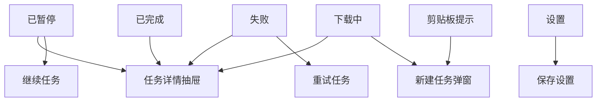

# MoodDownload 前端低保真原型说明

## 1. 文档信息

| 项目 | 内容 |
| --- | --- |
| 文档名称 | `MoodDownload 前端低保真原型说明` |
| 版本 | `v0.1-draft` |
| 原型模式 | `低保真原型说明` |
| 生成依据 | 前端详细设计文档 + 后端详细设计文档 |
| 主要输入 | [frontend-detailed-design.md](/Users/lying/IdeaProjects/moodDownload/docs/frontend-detailed-design.md) |
| 接口约束来源 | [backend-detailed-design.md](/Users/lying/IdeaProjects/moodDownload/docs/backend-detailed-design.md) |
| 适用范围 | `Electron` 桌面端页面原型、关键交互、状态覆盖 |
| 不在本文覆盖范围 | 高保真视觉稿、生产级代码、浏览器扩展页面 |

## 2. 提取后的页面模型

### 2.1 平台与角色

| 项 | 结果 |
| --- | --- |
| 平台 | `Windows 10/11` 桌面端 |
| 容器 | `Electron` |
| 技术形态 | `React SPA` |
| 用户角色 | `个人用户` |
| 导航结构 | `左侧导航 + 主内容区` |

### 2.2 页面清单

| 页面 / 浮层 | 类型 | 主要目标 | 关键接口 |
| --- | --- | --- | --- |
| 下载中 | 主页面 | 查看运行中 / 待调度任务 | `GET /api/tasks`、`GET /api/events/tasks` |
| 已完成 | 主页面 | 查看完成任务 | `GET /api/tasks` |
| 已暂停 | 主页面 | 查看暂停任务 | `GET /api/tasks` |
| 失败 | 主页面 | 查看失败任务、执行重试 | `GET /api/tasks` |
| 设置 | 主页面 | 配置目录、并发、限速、开关 | `GET /api/config`、`PUT /api/config` |
| 新建任务弹窗 | 全局浮层 | 创建 URL / 磁力 / 种子任务 | `POST /api/tasks`、`POST /api/tasks/torrent` |
| 任务详情抽屉 | 右侧浮层 | 查看单任务详情与快捷操作 | `GET /api/tasks/{id}` |
| 剪贴板提示条 / 弹窗 | 轻交互浮层 | 快速确认剪贴板任务 | `POST /api/tasks` |

### 2.3 核心流转



## 3. 选择的原型模式

本次采用 `低保真原型说明`，不直接跳高保真设计稿，也不直接写可运行代码。

原因：

- 当前目标是先把页面骨架、信息架构和交互面钉住
- 现有设计文档已经足够支撑页面原型，但视觉细节仍有 `TBD`
- 低保真原型更适合作为下一步“设计稿”或“可运行原型代码”的中间层

## 4. 全局壳层原型

### 4.1 桌面应用总体骨架

```text
┌──────────────────────────────────────────────────────────────────────┐
│ 标题栏 / 窗口控制 / 新建任务按钮 / 全局状态提示                     │
├───────────────┬──────────────────────────────────────────────────────┤
│ 左侧导航      │ 主内容区                                             │
│               │                                                      │
│ • 下载中      │ 页面标题 / 状态摘要条                                │
│ • 已完成      │ 搜索 / 筛选 / 批量动作区                            │
│ • 已暂停      │ 任务列表                                              │
│ • 失败        │                                                      │
│ • 设置        │                                                      │
│               │                                                      │
├───────────────┴──────────────────────────────────────────────────────┤
│ 底部轻提示区：SSE 状态 / 操作成功 / 操作失败                        │
└──────────────────────────────────────────────────────────────────────┘
```

### 4.2 全局交互区

- 顶部固定：
  - 新建任务按钮
  - 最小化 / 最大化 / 关闭
  - 托盘最小化入口
- 底部轻提示：
  - `SSE` 重连中
  - 设置保存成功
  - 任务操作失败

## 5. 页面低保真原型

### 5.1 下载中页

#### 页面目标

- 承担默认工作台
- 展示运行中与待调度任务
- 提供高频操作：新建、暂停、查看详情

#### 页面结构

```text
┌──────────────────────────────────────────────────────────────┐
│ 下载中                                      [新建任务]       │
├──────────────────────────────────────────────────────────────┤
│ 总任务数 | 活跃任务数 | 总下载速度 | SSE 状态               │
├──────────────────────────────────────────────────────────────┤
│ 搜索框        状态筛选        排序        批量动作(TBD)      │
├──────────────────────────────────────────────────────────────┤
│ [任务行] 名称 / 进度条 / 状态 / 速度 / 目录 / 操作按钮      │
│ [任务行] 名称 / 进度条 / 状态 / 速度 / 目录 / 操作按钮      │
│ [任务行] 名称 / 进度条 / 状态 / 速度 / 目录 / 操作按钮      │
└──────────────────────────────────────────────────────────────┘
```

#### 核心组件

- 页面标题栏
- 状态摘要条
- 搜索 / 筛选栏
- 任务列表
- 任务行操作区

#### 核心动作

- 点击新建任务
- 点击任务名打开详情抽屉
- 点击暂停

### 5.2 已完成页

#### 页面目标

- 回看已完成下载结果
- 支持查看详情和删除记录

#### 页面结构

```text
┌──────────────────────────────────────────────────────────────┐
│ 已完成                                                      │
├──────────────────────────────────────────────────────────────┤
│ 搜索框        时间筛选        目录筛选                      │
├──────────────────────────────────────────────────────────────┤
│ [任务行] 名称 / 完成时间 / 大小 / 保存目录 / 查看详情 / 删除 │
│ [任务行] 名称 / 完成时间 / 大小 / 保存目录 / 查看详情 / 删除 │
└──────────────────────────────────────────────────────────────┘
```

### 5.3 已暂停页

#### 页面目标

- 管理被用户暂停的任务
- 重点支持恢复

#### 页面结构

```text
┌──────────────────────────────────────────────────────────────┐
│ 已暂停                                                      │
├──────────────────────────────────────────────────────────────┤
│ 搜索框                                 [全部继续(TBD)]      │
├──────────────────────────────────────────────────────────────┤
│ [任务行] 名称 / 进度 / 暂停时间 / 继续 / 删除 / 详情         │
└──────────────────────────────────────────────────────────────┘
```

### 5.4 失败页

#### 页面目标

- 展示失败原因
- 支持重试和删除

#### 页面结构

```text
┌──────────────────────────────────────────────────────────────┐
│ 失败                                                        │
├──────────────────────────────────────────────────────────────┤
│ 错误筛选        最近失败时间                                │
├──────────────────────────────────────────────────────────────┤
│ [任务行] 名称 / 错误摘要 / 最近失败时间 / 重试 / 删除 / 详情 │
└──────────────────────────────────────────────────────────────┘
```

### 5.5 设置页

#### 页面目标

- 管理全局配置
- 配置更新后即时生效

#### 页面结构

```text
┌──────────────────────────────────────────────────────────────┐
│ 设置                                                        │
├──────────────────────────────────────────────────────────────┤
│ 默认下载目录      [输入框......................] [选择目录]   │
│ 最大并发下载数    [输入框]                                   │
│ 全局下载限速      [输入框]                                   │
│ 全局上传限速      [输入框]                                   │
│ 浏览器接管        [开关]                                     │
│ 剪贴板监听        [开关]                                     │
├──────────────────────────────────────────────────────────────┤
│                                          [取消(TBD)] [保存] │
└──────────────────────────────────────────────────────────────┘
```

### 5.6 新建任务弹窗

#### 页面目标

- 承载 URL / 磁力 / 种子三类创建入口

#### 弹窗结构

```text
┌──────────────────────────────────────────────┐
│ 新建任务                               [X]   │
├──────────────────────────────────────────────┤
│ 类型切换：URL | 磁力 | 种子                  │
├──────────────────────────────────────────────┤
│ 链接输入区 / 种子上传区                      │
│ 保存目录输入框 + 选择目录                    │
│ 自定义名称(TBD)                              │
├──────────────────────────────────────────────┤
│                              [取消] [创建]   │
└──────────────────────────────────────────────┘
```

### 5.7 任务详情抽屉

#### 页面目标

- 展示单任务完整信息
- 提供上下文操作

#### 抽屉结构

```text
┌──────────────────────────────────────┐
│ 任务详情                         [X]  │
├──────────────────────────────────────┤
│ 任务名称 / 状态标签                  │
│ 原始链接                              │
│ 保存目录                              │
│ 进度条                                │
│ 总大小 / 已下载 / 当前速度            │
│ 错误码 / 错误信息                     │
├──────────────────────────────────────┤
│ [暂停] [继续] [重试] [删除]           │
└──────────────────────────────────────┘
```

### 5.8 剪贴板提示条 / 弹窗

#### 页面目标

- 当识别到可创建链接时，给用户最短路径确认

#### 结构

```text
┌──────────────────────────────────────────────┐
│ 检测到可下载链接                              │
│ <链接预览>                                    │
│                               [忽略] [创建]   │
└──────────────────────────────────────────────┘
```

## 6. 关键交互原型

### 6.1 新建任务

1. 用户点击顶部 `新建任务`
2. 打开新建任务弹窗
3. 用户输入 URL / 磁力或上传种子
4. 用户选择保存目录
5. 点击 `创建`
6. 成功后弹窗关闭，任务出现在对应列表页

### 6.2 任务详情

1. 用户点击任务行
2. 右侧抽屉打开
3. 加载详情态展示骨架
4. 成功后展示完整信息和操作按钮
5. 用户可执行暂停 / 继续 / 重试 / 删除

### 6.3 列表实时刷新

1. 页面初始化拉取任务列表
2. 建立 `SSE` 连接
3. 收到 `task.updated`
4. 页面局部刷新对应任务行
5. 如连接中断，顶部提示“正在重连”

### 6.4 设置保存

1. 用户进入设置页
2. 页面加载当前配置
3. 用户修改字段
4. 点击保存
5. 成功反馈显示在页面或底部轻提示区

## 7. 页面状态覆盖

| 页面 / 模块 | normal | loading | empty | error | disabled | 备注 |
| --- | --- | --- | --- | --- | --- | --- |
| 下载中 | 是 | 是 | 是 | 是 | 是 | `SSE` 断线为轻告警态 |
| 已完成 | 是 | 是 | 是 | 是 | 是 | 删除按钮可能禁用 |
| 已暂停 | 是 | 是 | 是 | 是 | 是 | 恢复按钮受状态控制 |
| 失败 | 是 | 是 | 是 | 是 | 是 | 重试按钮受重试次数控制 |
| 设置页 | 是 | 是 | 否 | 是 | 是 | 保存中禁用提交 |
| 新建任务弹窗 | 是 | 否 | 否 | 是 | 是 | 提交中禁用关闭 `TBD` |
| 任务详情抽屉 | 是 | 是 | 否 | 是 | 是 | 依据任务状态控制按钮 |
| 剪贴板提示 | 是 | 否 | 否 | 否 | 是 | 无识别则不展示 |

## 8. 视觉方向低保真约束

当前只保留低保真层面的视觉约束，不进入高保真稿：

- 布局方向接近 `Motrix`
- 左侧导航较窄，主内容区高信息密度
- 列表型信息展示为主，而不是卡片瀑布流
- 风格偏极客风，但具体色板记为 `TBD`
- 托盘最小化必须在壳层中预留入口

## 9. 假设与 TBD

### 已采用假设

- 只做桌面端
- 单角色
- 直连本地后端
- 首版以列表视图为核心

### TBD

- 是否首版支持深色模式
- 是否首版提供“关于 / 日志查看”
- 新建任务成功后是否高亮新任务
- 设置页是否提供“恢复默认值”
- 列表页是否支持批量操作
- 新建任务弹窗是否支持自定义名称

## 10. 下一步建议

从这份低保真原型往下走，有两个自然方向：

1. 生成高保真设计稿 brief  
   适合继续喂给设计师或图片生成流程

2. 生成可运行原型代码  
   适合直接开始搭 `Electron + React` 的页面壳和交互 demo
